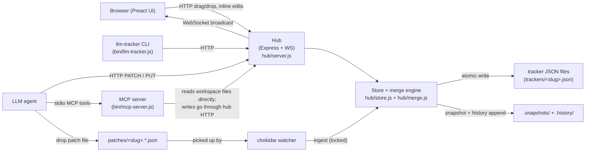
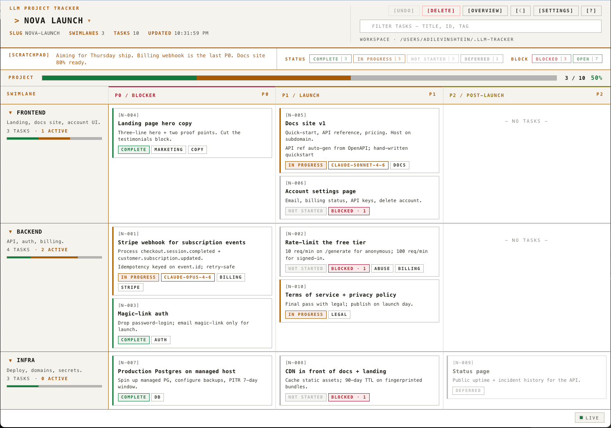
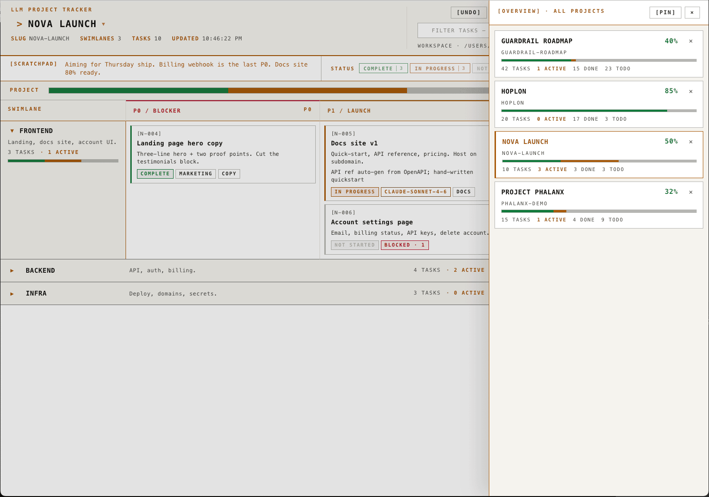
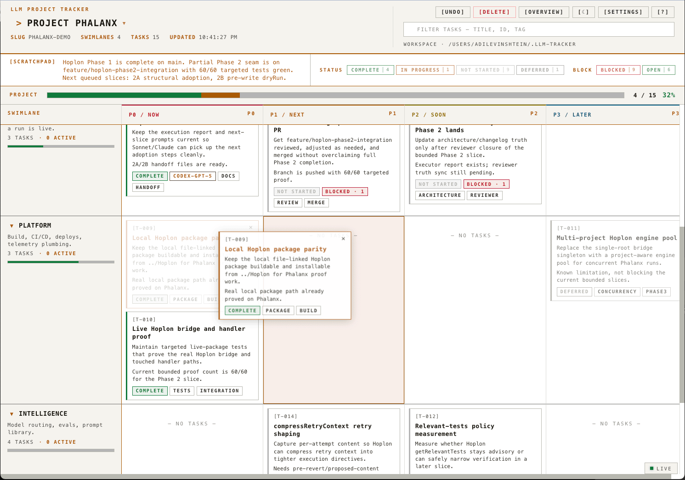
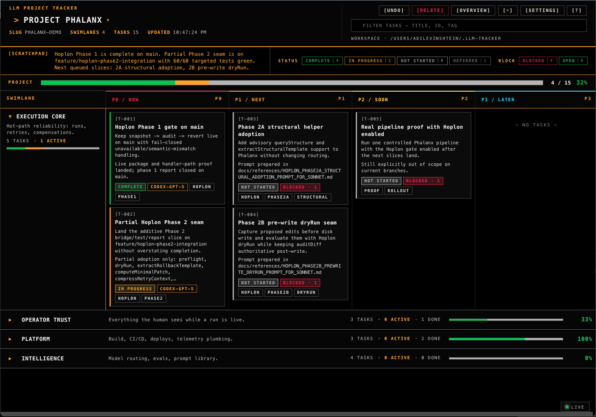

# llm-tracker

**A Kanban board for LLMs to keep their humans up to date.**

[](https://www.npmjs.com/package/llm-tracker)
[](https://github.com/justguy/llm-tracker/actions/workflows/ci.yml)
[](LICENSE)

Stop forcing your LLMs to re-read and rewrite massive architecture files just to update a status. `llm-tracker` is a **100 % local** mission-control center that bridges the gap between complex agentic workflows and human oversight.

It's a file-system-as-database tracker. Your LLMs update project states with tiny HTTP or file-based patches, and the local hub renders a live, **calm terminal-style** priority matrix so you can see exactly what your agents are doing at a glance.

When an agent needs to answer "what should I do next?", it can now make one call to `npx llm-tracker next <slug>` or `GET /api/projects/<slug>/next` and get a ranked executable shortlist instead of re-reading the full tracker. The ranking uses derived `actionability` (`executable`, `blocked_by_task`, `decision_gated`, `parked`) separately from lifecycle `status`, so decision-gated and blocked rows do not crowd out work an agent can actually act on.

When a human or agent asks "what about the feature with the..." instead of naming a task id, the hub now exposes both `GET /api/projects/<slug>/search?q=...` for local embedding-backed semantic search and `GET /api/projects/<slug>/fuzzy-search?q=...` for deterministic fuzzy lexical matching. Both modes are reachable from the UI through the global `⌘K` command palette (prefix `~` for fuzzy, `?` for semantic).

When an agent already knows the task id and needs focused context, it can now make one call to `npx llm-tracker brief <slug> <task-id>` or `GET /api/projects/<slug>/tasks/<taskId>/brief` and get a capped pack instead of rereading the tracker, docs, and code by hand.

When an agent needs to answer "why does this task exist?" or "what decisions did we already make?", it can now call `npx llm-tracker why <slug> <task-id>` or `npx llm-tracker decisions <slug>` instead of reconstructing that from raw comments and history.

When an agent is ready to act or validate work, it can now call `npx llm-tracker execute <slug> <task-id>` and `npx llm-tracker verify <slug> <task-id>` for deterministic execution and verification packs instead of inventing a plan from scratch.

When an agent needs the current contract for a running hub, it should call `GET /help` first instead of guessing write modes or endpoints.

The UI exposes the same deterministic loop for humans through the refined Variant A2 layout:

- **Top bar** — project name with `▾` quick-switch, rev badge, `agent` cluster (`[NEXT]`, `[BLOCKERS]`, `[CHANGED]`, `[DECISIONS]`), `history` cluster (`[UNDO]`, `[REDO]`), the `⌘K` palette input, and a `⋯` overflow menu for retired actions (collapse/expand all lanes, open overview, settings, help, theme toggle, delete project).
- **Hero strip** — big progress headline, 2×3 status grid, and a green *Recommended Next* callout with `[PICK]` and `[READ]` buttons sourced from `/next?limit=1`.
- **One-line scratchpad** — a `NOTE` row with `[EXPAND]` to read the full note and `[EDIT]` for an inline textarea (`cmd+enter` saves).
- **Swimlane/tree/graph view toggle** — the filter row includes `[SWIMLANE]`, `[TREE]`, and `[GRAPH]`; tree view uses explicit `kind: "group"` / `parent_id` hierarchy when present and falls back to swimlanes as top-level groups.
- **Dependency graph view** — a derived UI projection over existing `dependencies[]` blocker edges. It does not add schema or data fields, and its optional `[CONTAINMENT]` overlay draws `parent_id` tree/group edges as a visual aid only.
- **Task cards** — three tiers (id + title, summary, status/assignee/tags) with a `[READ]/[WHY]/[EXEC]/[VERIFY]` bracket row. Clicking a card expands an **inline drawer** in place (brief by default; `[WHY]`/`[EXEC]`/`[VERIFY]` tabs render their own packs without leaving the board).
- **`⌘K` command palette** — projects + tasks + retired header actions (filter, fuzzy via `~`, semantic via `?`, jump-to-next, collapse/expand all, undo/redo, theme toggle, settings, help).
- **Themes** — calm warm-paper light and calibrated dark, both from the same token set; toggle from the `⋯` menu.

## Architecture at a glance



All write paths converge on the Store under a per-slug lock; the hub is the sole arbiter of merge and revision stamping. See [ARCHITECTURE.md](./ARCHITECTURE.md) for the full contract.

## Why use llm-tracker?

🔒 **100 % Local & Secure** — the core hub doesn't ping any LLM APIs; it watches your local filesystem, merges patches, and serves the UI. Your project state never leaves your machine. Semantic `/search` uses a local embedding model and only reaches out once if the model is not already cached on disk.

The hub binds to `127.0.0.1` by default, rejects cross-origin mutating requests, and supports an optional bearer token (`LLM_TRACKER_TOKEN`) that gates every write without exposing the raw secret to the browser UI. See [Local security](#local-security) for the full threat model and override knobs.

💸 **Massive Token Savings** — no full-file rewrites. LLMs send surgical JSON patches (often <100 bytes) and pull changes since their last rev, keeping context windows small and API costs low.

⚡ **Stupidly Simple** — no databases, no cloud accounts, and no behavior surprises. `npx llm-tracker init`, `npx llm-tracker`, open the browser. Foreground remains the default; an optional local background daemon is available if you do not want to dedicate a shell. Every project is one JSON file you can `cat`, diff, or commit.

---

## Screenshots

**Main view** — top bar, hero strip (progress + status grid + Recommended Next), one-line `NOTE` scratchpad, and the swimlane × priority board with an alternate task tree view.



**Task comments** — each task has an optional `comment` field (≤ 500 chars). Set it via JSON, patch API, or the inline `[+C]` editor on the card; hover the `[C]` badge to read it. The popover clamps to the viewport so cards near the edges don't clip.

**Overview drawer** — all projects at a glance; click to switch, pin to keep it open. Also reachable from the project-name `▾` dropdown and the `⋯` overflow menu.



**Drag and drop** — re-prioritize or move tasks across swimlanes; hub writes atomically, UI updates live. The dragged card lifts with a soft shadow and valid drop cells show a dashed highlight.



**Dark (default) and light themes** — both calibrated from the same A2 token set; toggle from the `⋯` overflow menu. Body text meets WCAG AA at 14.5px in both themes.



---

## Install (30 seconds)

```bash
npx llm-tracker init     # scaffolds ~/.llm-tracker workspace
npx llm-tracker          # starts hub + UI on http://localhost:4400
npx llm-tracker --daemon # same hub, but detached into the background
```

The first command prints a paste-ready prompt. Give it to any LLM with file-write or HTTP access, and your project appears in the UI within half a second.

Or install globally once:

```bash
npm install -g llm-tracker
llm-tracker init && llm-tracker
```

### Day 0 project skeleton

Every tracker is one JSON file with two top-level keys: `meta` and `tasks`. The minimal shape the hub accepts — copied from `workspace-template/templates/default.json` — is:

```json
{
  "meta": {
    "name": "New Project",
    "slug": "new-project",
    "swimlanes": [
      { "id": "main", "label": "Main" }
    ],
    "priorities": [
      { "id": "p0", "label": "P0 / Now" },
      { "id": "p1", "label": "P1 / Next" },
      { "id": "p2", "label": "P2 / Soon" },
      { "id": "p3", "label": "P3 / Later" }
    ],
    "scratchpad": ""
  },
  "tasks": []
}
```

Drop this at `<workspace>/trackers/<slug>.json` (with `meta.slug` matching the filename) and the hub renders it immediately. Field-by-field contract → [ARCHITECTURE.md](./ARCHITECTURE.md).

Tasks may also opt into tree grouping with `kind: "group"` and `parent_id`. `parent_id` is containment only; execution blockers still belong in `dependencies`. Groups can nest by pointing one group at another group through `parent_id`. If a tracker has no explicit groups or parents, tree view treats swimlanes as the root groups. Tree display order is swimlane, then priority, then the hub-owned task array order.

The dependency graph view, when shown, is derived from those same `dependencies[]` blocker edges. It is display-only: it does not introduce new task fields, graph fields, or alternate containment semantics. The graph's optional `[CONTAINMENT]` overlay can draw `parent_id` tree/group edges as dashed visual context; those overlay edges do not affect block state or execution order.

## Supported Topologies

`llm-tracker` supports two deployment shapes:

- Recommended: **one shared workspace + one shared daemon + many linked projects.** Run the hub on a central workspace such as `~/.llm-tracker`, then link repo-local tracker files into it with `npx llm-tracker link <slug> <abs-path>`. This gives one source of truth for humans and agents.
- Supported: **multiple isolated workspaces + multiple daemons.** Useful for demos, sandboxes, or teams that want hard isolation. Each daemon needs its own workspace folder and port.

If you keep a tracker file in a repo and link it into the shared workspace:

- the shared daemon automatically watches the linked tracker file for direct edits
- the shared daemon automatically watches the shared workspace `patches/` directory
- patch files belong in the shared workspace, not in the repo-local `.llm-tracker/` folder
- the repo-local tracker JSON is a linked durable target of the shared hub, not branch-local scratch state or a merge artifact
- durable tracker writes still land on the linked repo-local tracker file itself; that is sync, not relocation
- if that linked tracker JSON is versioned inside the repo, expect successful patch writes that change durable fields to update the repo-visible JSON file in place
- linked trackers use the repo-local tracker JSON as the only project truth
- for linked trackers, task state, assignee, blocker notes, scratchpad, timestamps, and rev all write through to the repo-visible JSON so branch checkouts and rollbacks carry tracker state with code
- legacy linked-tracker overlays in `.runtime/overlays/<slug>.json` are not project truth and are cleared on ingest/write
- durable tracker edits still update the linked repo-local JSON in place, and `GET /api/projects/<slug>` / successful patch responses expose that durable path as `file`
- never use `git restore`, `git checkout`, `git stash`, or merge-conflict cleanup as a tracker update mechanism; verify with `/help` or `GET /api/projects/<slug>`, then use `tracker_patch`, `tracker_start`, `tracker_pick`, `tracker_reload`, or the equivalent HTTP endpoints

**Landing gate.** For linked repo-local trackers, patch the tracker **before** you commit or push the matching code, and include the tracker JSON diff in the same commit. Patching after a commit/push leaves the working tree dirty; patching after a squash-merge dirties `main`. Because the repo JSON is the only project truth, status notes and assignment changes are branch state too. See the agent contract at `/help` for the full rule.

> Before push or merge, prove `.llm-tracker/trackers/hoplon.json` on the branch contains the live tracker truth for the touched tasks. Compare `tracker_brief` against the repo file and against `origin/main`. Do not restore, stash, or discard tracker diffs. If merging would regress tracker truth, stop and make a tracker-sync commit/PR first.

## Agent Help

> **For agents.** The authoritative contract LLMs should follow is
> [`workspace-template/README.md`](workspace-template/README.md), which is
> served live at `GET /help`. If you are an agent / LLM, read that file (or
> call `/help`) rather than this one.

Running hubs expose `GET /help` as the current agent contract for that workspace.

- It serves the workspace `README.md`
- For standard workspaces, that file comes from [`workspace-template/README.md`](./workspace-template/README.md)
- Agents should read `/help` before using write paths or task-intelligence endpoints
- Agents should prefer `next` to choose work, `brief` to load task context, `why` to explain task intent, `decisions` to recall prior decisions, and `execute` / `verify` to close the work loop before broad file reads
- If you change agent-facing behavior, update the workspace template so `/help` stays accurate

---

## Wire it into your LLM CLI

Drop a one-line file into your coding CLI's rules/skills folder. That's the whole install. Next time you ask "what's the state of my projects?" the LLM runs `npx llm-tracker status` on its own.

That path is still prompt-driven. It saves rereads, but it still spends model tokens.

**Claude Code** — create `~/.claude/skills/llm-tracker-status/SKILL.md`:

```markdown
---
description: Show overall status of LLM Project Tracker projects.
---

When the user asks about project status, progress, or what the tracker shows, run:

    npx llm-tracker status

For one project in detail: `npx llm-tracker status <slug>`.
For JSON (chainable): `npx llm-tracker status --json`.
```

**Every other CLI** — one sentence pointing at the same command:

| Environment  | Drop the line at                                    |
| ------------ | --------------------------------------------------- |
| Cursor       | `.cursor/rules/llm-tracker.md`                      |
| Windsurf     | append to `.windsurfrules`                          |
| Aider        | append to `CONVENTIONS.md`                          |
| Anything else | `AGENTS.md` in the repo root                       |

Each file just says: *"For project status, run `npx llm-tracker status`."* That's it.

If the hub is already running, add one more line: *"Before using the tracker, read `GET /help`."*

---

## Zero-token terminal shortcut

If you want direct tracker commands from a Codex or Claude terminal session without asking the model anything, print the shell wrapper once and load it into your shell:

```bash
eval "$(npx llm-tracker shortcuts)"
```

The default short alias for `llm-tracker` is `lt`. That command creates a small `lt` shell function. Use it like:

```bash
lt next project-phalanx
lt brief project-phalanx t-021
lt why project-phalanx t-021
lt execute project-phalanx t-021
lt verify project-phalanx t-021
```

To keep it permanently, append the printed snippet to `~/.zshrc` or `~/.bashrc`. If you want a different function name, use `npx llm-tracker shortcuts --alias tracker`.

---

## Shell commands

```bash
# Zero-token shell wrapper for lt next / lt brief / lt verify
npx llm-tracker shortcuts            # prints a bash/zsh function wrapper

# Works with hub NOT running — reads files directly
npx llm-tracker status              # dashboard of all projects
npx llm-tracker status <slug>       # detail on one project
npx llm-tracker status --json       # machine-readable

# Requires hub running
npx llm-tracker help                     # local CLI usage help
npx llm-tracker blockers <slug>        # structural blockers and what they are waiting on
npx llm-tracker changed <slug> <rev>   # changed tasks since a rev
npx llm-tracker search <slug> <query>  # semantic local-model search (requires hub)
npx llm-tracker fuzzy-search <slug> <query>  # deterministic fuzzy lexical search (requires hub)
npx llm-tracker start <slug> <task-id> --assignee codex  # explicit start; assignee required unless env is set
npx llm-tracker pick <slug> [task-id] --assignee codex  # atomic claim, defaults to top executable task
npx llm-tracker next <slug> [--limit 5] [--include-gated]  # ranked executable shortlist
npx llm-tracker since <slug> <rev>  # event log since a rev (for LLMs to catch up)
npx llm-tracker rollback <slug> <rev>
npx llm-tracker link <slug> <abs-path>  # symlink an external tracker into the workspace
npx llm-tracker repair-linked-overlays --write  # one-time repair for legacy linked overlay state
npx llm-tracker reload [<slug>]         # rescan one or all trackers from disk

# Optional background lifecycle
npx llm-tracker --daemon                  # start hub in the background
npx llm-tracker daemon status             # show pid / port / log path
npx llm-tracker daemon stop               # stop the background hub
npx llm-tracker daemon restart            # restart the same background hub
npx llm-tracker daemon logs --lines 80    # print recent daemon logs

# For LLMs talking to the running hub
curl http://localhost:4400/help           # current workspace agent contract
```

Full flag reference: `npx llm-tracker help`.

## HTTP API Quick Reference

The HTTP hub is the clean machine interface for agent clients.

Start with:

```bash
curl http://localhost:4400/help
```

That returns the active workspace contract for the running hub. In daemon mode on
another port, use the port recorded in `.runtime/daemon.json` or
`npx llm-tracker daemon status`.

### Core read endpoints

```bash
# Workspace / project overview
curl http://localhost:4400/help
curl http://localhost:4400/api/projects
curl http://localhost:4400/api/projects/<slug>
curl "http://localhost:4400/api/projects/<slug>/next?limit=5"
curl "http://localhost:4400/api/projects/<slug>/next?limit=5&includeGated=true"
curl "http://localhost:4400/api/projects/<slug>/since/<rev>"

# Focused task context
curl http://localhost:4400/api/projects/<slug>/tasks/<taskId>/brief
curl http://localhost:4400/api/projects/<slug>/tasks/<taskId>/why
curl http://localhost:4400/api/projects/<slug>/tasks/<taskId>/execute
curl http://localhost:4400/api/projects/<slug>/tasks/<taskId>/verify

# Project-level context
curl "http://localhost:4400/api/projects/<slug>/decisions?limit=20"
curl http://localhost:4400/api/projects/<slug>/blockers
curl "http://localhost:4400/api/projects/<slug>/changed?fromRev=<rev>&limit=20"
curl "http://localhost:4400/api/projects/<slug>/history?limit=50"

# Search
curl "http://localhost:4400/api/projects/<slug>/search?q=<query>"
curl "http://localhost:4400/api/projects/<slug>/fuzzy-search?q=<query>"
```

Use `search` for feature-shaped questions and `fuzzy-search` when you want a
deterministic lexical fallback.

### Core write endpoints

Use HTTP writes when you want to avoid touching the workspace filesystem.

```bash
# Explicit task start
curl -X POST http://localhost:4400/api/projects/<slug>/start \
  -H "Content-Type: application/json" \
  -d '{"taskId":"<task-id>","assignee":"codex","scratchpad":"starting <task-id>"}'

# Atomic claim / pick; omit taskId to claim the top executable task
curl -X POST http://localhost:4400/api/projects/<slug>/pick \
  -H "Content-Type: application/json" \
  -d '{"taskId":"<task-id>","assignee":"codex"}'

# Fire-and-forget project patch
curl -X POST http://localhost:4400/api/projects/<slug>/patch \
  -H "Content-Type: application/json" \
  --data-binary @/tmp/<slug>-patch.json

# Revision controls
curl -X POST http://localhost:4400/api/projects/<slug>/undo
curl -X POST http://localhost:4400/api/projects/<slug>/redo

# Reload trackers from disk
curl -X POST http://localhost:4400/api/projects/<slug>/reload
```

Successful `POST /api/projects/<slug>/patch` responses are authoritative immediately. They now return the accepted post-write `rev`, `updatedAt`, `noop`, `noopReason`, `workspace`, `port`, `file`, `registrationFile`, and `topology` (`shared-workspace` or `repo-linked`). `file` is the effective tracker JSON path the hub wrote, which is the repo-local target for linked projects. When `noop: true`, `noopReason` explains whether the submitted values already matched current state or which operation was ignored/rejected and how to retry. When `file` points at a repo-local tracker, durable patch writes are expected to update that visible JSON file right away.

Patch payloads may include top-level `expectedRev`. If it does not match the current project rev, the hub rejects the write with `409` and returns `type: "conflict"`, `expectedRev`, `currentRev`, and a retry hint.

Patch payloads may also include structural operation arrays when a narrow merge is clearer than a full replacement:

- `swimlaneOps`: `{op:"add"|"update"|"move"|"remove"}` with lane ids, optional `index`/`direction`, and `reassignTo` when removing a lane with tasks.
- `taskOps`: `{op:"move"|"archive"|"split"|"merge"}` for card placement, deferring folded work, creating an open follow-up after a source task, or recording a source task as merged into a target.

Structural failures return the same `{error, type, hint}` envelope plus `repair` when the hub can describe a safe retry. For example, removing a swimlane that still contains tasks returns `repair.moveTasksTo`, `repair.affectedTaskIds`, and a ready-to-retry `repair.swimlaneOps` shape.

Patch payloads stay small. Typical shape:

```json
{
  "expectedRev": 42,
  "taskOps": [
    { "op": "move", "id": "t-002", "swimlaneId": "active", "priorityId": "p0" }
  ],
  "tasks": {
    "t-001": {
      "status": "complete",
      "context": {
        "notes": "shipped",
        "roadmap_section": "Roadmap section 04",
        "roadmap_reference": "docs/ROADMAP.md:40-52",
        "execution_report_reference": "docs/reports/EXECUTION.md:1-20",
        "architecture_reference": "ARCHITECTURE.md:200-220"
      }
    }
  },
  "meta": {
    "scratchpad": "t-001 closed; t-002 is next"
  }
}
```

### Practical rule of thumb

- Read `/help` first.
- Use `next`, `brief`, `why`, `execute`, and `verify` instead of rereading the whole tracker.
- Use `patch` for status/content updates.
- Use `start` when you know the exact task and want to atomically set `status: in_progress`, assignee, and optional scratchpad.
- Use `pick` when you want an atomic claim instead of hand-rolling status changes, especially when the hub should select the top executable task.
- Keep writes small and frequent.

### Agent Interfaces

This project ships a stdio MCP server via `llm-tracker mcp`.

Use the workspace contract first, then the narrowest interface that fits:

- read `GET /help` or `tracker_help` first for the active workspace contract
- use `tracker_next`, `tracker_brief`, `tracker_why`, `tracker_decisions`, `tracker_execute`, `tracker_verify`, `tracker_search`, and `tracker_fuzzy_search` for focused reads
- use `tracker_patch`, `tracker_start`, `tracker_pick`, `tracker_undo`, `tracker_redo`, and `tracker_reload` through the running hub for authoritative writes

Register the server in your client config instead of launching it manually:

```toml
[mcp_servers.llm-tracker]
command = "node"
args = [
  "/Users/you/path/to/llm-project-tracker/bin/llm-tracker.js",
  "mcp",
  "--path",
  "/Users/you/.llm-tracker",
]
startup_timeout_sec = 60
```

MCP reads work directly from workspace files and include `workspace`, `port`, `file`, `registrationFile`, and `topology` when they return project-specific payloads. MCP writes still require the shared hub or daemon to be reachable.

## Background daemon

Foreground startup is still the default. Existing users can keep using `npx llm-tracker` exactly as before.

If you want the hub to keep running without a dedicated shell, use `npx llm-tracker --daemon` or `npx llm-tracker daemon start`. Runtime artifacts live under `~/.llm-tracker/.runtime/` by default:

- `daemon.json` stores pid, port, and startup metadata
- `daemon.log` captures hub stdout and stderr

Existing workspaces do not need migration work. The `.runtime/` directory is created on demand the first time daemon mode is used.

Hub-backed CLI commands reuse the active daemon port from `.runtime/daemon.json` when you omit `--port`, so `brief`, `why`, `decisions`, `execute`, `verify`, `next`, `blockers`, `changed`, `start`, `pick`, `since`, `rollback`, `link`, and `reload` keep working against a background hub started on a non-default port.

Daemon state is **workspace-scoped**. `npx llm-tracker daemon stop --path <dir>` only affects the daemon for that workspace. In the recommended shared-daemon topology, that means one daemon for the central workspace and linked repo-local project files underneath it.

### Daemon troubleshooting

The hub now rescans tracker files on startup, eagerly loads trackers created through `link`, auto-reloads missing slugs on demand, and refreshes the project list from disk before serving `/api/projects`. In normal use, that should remove most "restart to see the project" failures.

If a tracker exists on disk but does not appear in the UI or a slug 404s unexpectedly:

1. If a specific slug 404s, retry the request once. The hub now attempts an on-demand reload for missing slugs.
2. Run `npx llm-tracker reload [<slug>] --path <workspace>` to rescan one slug or the whole workspace explicitly.
3. If it is a symlinked repo-local tracker, make sure it was registered through `npx llm-tracker link ...` rather than by manual symlink creation.
4. If the daemon itself looks stale, run `npx llm-tracker daemon restart --path <workspace>`.

If `daemon stop` times out or hub-backed commands say `Hub not reachable`:

1. Run `npx llm-tracker daemon status --path <workspace>` and `npx llm-tracker daemon logs --path <workspace> --lines 120`.
2. If the recorded PID still exists but the recorded port does not answer, stop that PID manually.
3. Run `daemon status` again. If the process is gone but `.runtime/daemon.json` is still present, remove the stale metadata file and start the daemon again.

Do **not** fix this by creating a second accidental workspace in the repo. The correct recovery target is the original workspace.

---

## The Contract (TL;DR)

**The hub owns structure. The LLM owns content.**

- **LLM writes** — statuses, assignees, dependencies, notes, tags, priorities, new tasks, scratchpad
- **Hub enforces** — task array order, existence (no accidental deletion), human UI state (drag positions, swimlane collapse), version stamps

Two patch-time guardrails now matter for agent reliability:

- append brand-new patch tasks only as `not_started` or `in_progress`, not already `complete` or `deferred`
- use `reference` / `references[]` only in `path:line` or `path:line-line` form; bare URLs are rejected with an explicit hint

LLMs send small patches. The hub merges them under a per-project lock, bumps `meta.rev`, writes a full snapshot, and appends a `{rev, delta}` line to the history log. When the LLM needs to refresh, it calls `GET /api/projects/:slug/since/<last-rev>` and gets only what changed — **constant-size payload regardless of project size**.

For task pickup, prefer the atomic claim flow over hand-built status patches:

- `GET /api/projects/:slug/tasks/:taskId/brief`
- `npx llm-tracker brief <slug> <task-id>`
- `GET /api/projects/:slug/tasks/:taskId/why`
- `npx llm-tracker why <slug> <task-id>`
- `GET /api/projects/:slug/decisions`
- `npx llm-tracker decisions <slug>`
- `GET /api/projects/:slug/tasks/:taskId/execute`
- `npx llm-tracker execute <slug> <task-id>`
- `POST /api/projects/:slug/start`
- `POST /api/projects/:slug/tasks/:taskId/start`
- `npx llm-tracker start <slug> <task-id> --assignee <model>` (`LLM_TRACKER_ASSIGNEE` may supply the assignee)
- `GET /api/projects/:slug/tasks/:taskId/verify`
- `npx llm-tracker verify <slug> <task-id>`
- `POST /api/projects/:slug/pick`
- `npx llm-tracker pick <slug> [task-id] --assignee <model>`

For feature-oriented or fuzzy questions, prefer:

- `GET /api/projects/:slug/search?q=<query>`
- `npx llm-tracker search <slug> <query>`
- `GET /api/projects/:slug/fuzzy-search?q=<query>`
- `npx llm-tracker fuzzy-search <slug> <query>`

Legacy compatibility: if an older patch or tracker file still uses `status: "partial"`, the hub normalizes it to `in_progress` on ingest and writes back the canonical value.

`outcome` is separate from `status`: use `partial_slice_landed` when a bounded slice shipped but the task remains open. Progress % still keys only off the four status values above.

`actionability` is also separate from `status`: the hub derives `executable`, `blocked_by_task`, `decision_gated`, or `parked` from dependencies, approval requirements, aggregate rows, and lifecycle state. `next` ranks executable work by default; `includeGated=true` / `--include-gated` adds decision-gated rows for diagnostics.

Traceability is derived from optional author-owned `context` keys so tracker rows can point back to planning truth without schema churn: `context.roadmap_section`, `context.roadmap_reference`, `context.execution_report`, `context.execution_report_reference`, `context.architecture_truth_doc`, and `context.architecture_reference`. Brief, why, execute, verify, search, changed, and next payloads expose these as `traceability`.

### Semantic search stack

- Semantic `/search` uses [`@huggingface/transformers`](https://github.com/huggingface/transformers.js) in the local Node.js hub.
- The default embedding model is [`Xenova/all-MiniLM-L6-v2`](https://huggingface.co/Xenova/all-MiniLM-L6-v2).
- Both are Apache-2.0 licensed.
- The first semantic query may download the model into the local Hugging Face cache; after that, query embedding and cosine ranking stay local.
- Semantic `/search` now tries the native Node runtime first, then a local WASM runtime bundled from `onnxruntime-web`, then a bundled offline hash runtime, and only then degrades to deterministic fuzzy matching.
- If semantic has to fall back, the payload returns a warning. If model runtimes are unavailable, `/search` can still return semantic results with `backend: "semantic_hash_fallback"`; only unexpected runtime failures degrade to `backend: "fuzzy_fallback"`.
- `/fuzzy-search` remains the deterministic lexical fallback when you want approximate string matching without loading embeddings.

Two write modes:

- **Mode A — File patches** (bash-less): LLM drops a JSON patch in `patches/<slug>.<ts>.json`; hub picks it up and deletes it.
- **Mode B — HTTP patches** (fastest): `POST /api/projects/:slug/patch`; one-time `curl` approval in your CLI, then no filesystem access.

Patch failures now return `error`, `type`, and `hint` so agents do not have to reverse-engineer raw schema regex output. The same hint-bearing payload is also written to `.errors.json` files in file-patch mode.

Full schema, merge semantics, field ownership, versioning, rollback, and the whole LLM-facing contract → **[ARCHITECTURE.md](./ARCHITECTURE.md)**.

Migrating an older `0.1.x` workspace or tracker set to the `1.0.0` contract, including agent backfill guidance for the new fields → **[MIGRATING.md](./MIGRATING.md)**.

That migration guide also covers existing shared-workspace projects linked from repo worktrees: relink the slug to the intended branch file, `reload` it, backfill bounded active tasks first, verify with `execute` / `verify` / `search`, and stop before any commit unless the human asked for one.

If a linked slug is already registered, the safe relink flow is: remove the current workspace symlink registration, re-link the slug to the new absolute target path, then `reload` it. That unregister step removes only the shared workspace symlink, not the real tracker file in the repo/worktree.

It now also calls out an easy failure mode: a patch that adds only `references[]`, `effort`, `related`, and `comment` is retrieval-only enrichment, not a complete migration batch for active tasks.

The migration guidance now also tells agents to evaluate the full author-owned field set for active tasks, including `goal`, `context.*`, and `blocker_reason`, rather than treating only the retrieval and execution-contract subsets as the whole job.

It also now makes the reference rule explicit: for linked repo-local trackers, keep repo file references portable and repo-relative. If a valid repo-relative reference is not producing snippets, `reload` and treat it as a resolver/runtime problem to report, not as a cue to rewrite the tracker with machine-specific absolute paths.

---

## How it looks under the hood

```
┌──────────┐    patch       ┌──────────────┐     merge     ┌──────────┐
│   LLM    ├───HTTP or file►│  Hub (Node)  │────────────►  │  <slug>  │
└──────────┘                │              │  atomic write │  .json   │
                            │              │               └──────────┘
┌──────────┐   drag/drop    │              │
│ Browser  ├───POST /move───►              │
└────▲─────┘                └──────┬───────┘
     │                             │
     └─────────WebSocket broadcast─┘
```

---

## Development

```bash
npm install
npm test           # Node's built-in test runner
npm start          # hub on http://localhost:4400
node bin/llm-tracker.js --daemon  # optional background hub in dev
```

Module map, internals, and schema deep-dive → **[ARCHITECTURE.md](./ARCHITECTURE.md)**.

---

## Contributing & releases

The repo ships every change through **issues → feature branch → PR → automated release**.

**1. Propose a change** — open a GitHub issue (`bug`, `enhancement`, etc.). Attach it to a milestone if you want it scoped to a specific release.

**2. Branch + PR** — branch off `main` using a prefix that matches the work (`fix/…`, `feat/…`, `docs/…`, `chore/…`). `main` is protected: no direct pushes, PR-only, linear history, squash-merge.

**3. PR title = Conventional Commits** — squash-merge uses the PR title as the commit subject on `main`. A CI check rejects titles that don't match `feat:` / `fix:` / `docs:` / `refactor:` / `perf:` / `chore:` / etc. Close the relevant issue with `Closes #N` in the body.

**4. Merge lands on `main` immediately** — no need to hold PRs for a release. Feature work and releases are decoupled.

**5. Release-please accumulates** — every commit on `main` updates a rolling "release PR" (auto-opened by [release-please](https://github.com/googleapis/release-please)) that bumps `package.json` and appends to `CHANGELOG.md` based on the commit types:

| Commit type(s) since last tag | Version bump        |
| ----------------------------- | ------------------- |
| any `feat!:` / `BREAKING CHANGE:` footer | major (x.0.0) |
| any `feat:`                   | minor (0.x.0)       |
| only `fix:` / `perf:`         | patch (0.0.x)       |
| only `chore:` / `ci:` / `test:` / `docs:` / `refactor:` | no bump (hidden from notes) |

**6. Cut a release** — merge the release PR when you want to ship. That tags `v*.*.*`, which triggers `publish.yml` → `npm publish`. You decide the cadence: after every feature, weekly, or whenever a milestone closes.

Workflow files: [`.github/workflows/release-please.yml`](./.github/workflows/release-please.yml), [`.github/workflows/pr-title.yml`](./.github/workflows/pr-title.yml), [`release-please-config.json`](./release-please-config.json).

---

## Local security

The hub is a local service. It ships three layers that matter if another process (or a browser tab on the same machine) tries to talk to it:

- **Loopback binding** — by default the listener binds to `127.0.0.1`, so other hosts on the LAN cannot reach it. Override with `LLM_TRACKER_HOST=0.0.0.0` if you consciously want LAN access.
- **Cross-origin guard** — every mutating request (`POST` / `PUT` / `PATCH` / `DELETE`) must either have no `Origin` header (trusted CLI / `curl` / MCP context) or carry an origin that exactly matches the hub origin serving that request. Loopback origins are always allowed too. Anything else returns `403`, so browser CSRF stays blocked even if you deliberately expose the hub on a LAN IP.
- **WebSocket guard** — `/ws` uses the same origin policy. Cross-origin browser upgrades are rejected with `403`, so a malicious page cannot subscribe to tracker broadcasts from another site.
- **Optional bearer token** — set `LLM_TRACKER_TOKEN=<secret>` before starting the hub and every mutating request must include `Authorization: Bearer <secret>` (or `X-LLM-Tracker-Token: <secret>`). The CLI picks the token up from the same env var automatically. The browser UI gets a short-lived HttpOnly same-origin session cookie when it loads `index.html`, so the raw secret is never injected into page JavaScript.
- **WebSocket auth when tokenized** — when `LLM_TRACKER_TOKEN` is set, `/ws` also requires `Authorization: Bearer <secret>` (or `X-LLM-Tracker-Token`) unless the request carries the UI's short-lived same-origin session cookie.

Body-size hardening:

- Default JSON body limit is **1 MB** (override with `LLM_TRACKER_BODY_LIMIT`, e.g. `LLM_TRACKER_BODY_LIMIT=4mb`).
- Route-level guards reject oversized `meta.scratchpad` (> 5000 chars), `task.comment` (> 500 chars), and `task.blocker_reason` (> 2000 chars) before merge/validation runs, so hallucinated jumbo patches cost the hub almost nothing.

## Deleted-project restore

`DELETE /api/projects/<slug>` (or the UI `[DELETE]` button) removes the registered tracker file but preserves `.snapshots/<slug>/` and `.history/<slug>.jsonl` for audit. To bring a deleted project back:

```bash
# restore latest snapshot
llm-tracker restore <slug>

# restore a specific rev
llm-tracker restore <slug> --rev 7
```

Or over HTTP:

```bash
curl -X POST http://localhost:4400/api/projects/<slug>/restore \
  -H "Content-Type: application/json" -d '{"rev": 7}'
```

`restore` vs `undo` vs `rollback`:

- `restore` — bring back a project that was fully deleted (`DELETE /api/projects/<slug>`). Refuses if the project is still registered, writes a fresh audited rev, and records a `restore` event in `.history/<slug>.jsonl`.
- `undo` — reverse the last accepted revision on a **currently registered** project.
- `rollback` — set a registered project back to any prior rev as a new, auditable rev.

Tombstones — when a human deletes a task (via the UI `[×]` button or `DELETE /api/projects/<slug>/tasks/<taskId>`), the id is recorded in `meta.deleted_tasks`. This hub-owned list blocks stale LLM writes from silently resurrecting the deleted task. Rolling back to a rev that predates the deletion clears the tombstone.

## Windows support

The hub runs on Windows, but a few paths need extra care:

- **Symlinking repo-local trackers (`llm-tracker link`, Option C)** — `symlinkSync` requires either Developer Mode (Settings → Privacy & security → For developers) or running the shell as Administrator. If you hit `EPERM` / `EACCES`, fall back to `PUT /api/projects/<slug>` (Option B) instead — it has no filesystem-privilege requirements.
- **File watchers** — the main `trackers/` watcher uses native filesystem events. Polling is enabled only for symlinked targets that live outside the workspace, and only on the specific target files — not their parent directories — so CPU cost stays bounded even when a target lives deep inside a repo.
- **Line endings** — tracker JSON is written with `\n` on all platforms. Leave core.autocrlf to your preference in the repo itself; the hub never rewrites linked files for EOL.
- **Paths** — Windows absolute paths (`C:\Users\...`) work everywhere an absolute path is expected.
- **LAN access** — if you override `LLM_TRACKER_HOST`, open the UI through the real host or IP you bound for. Browser writes remain same-origin only; a page loaded from some other site still gets `403`.

CI currently targets Linux and macOS. Windows-specific behavior is documented but not yet gated by CI — expect the Linux/macOS matrix to be the canonical coverage until a Windows runner lands.

## License

Apache-2.0 — see [LICENSE](LICENSE).
